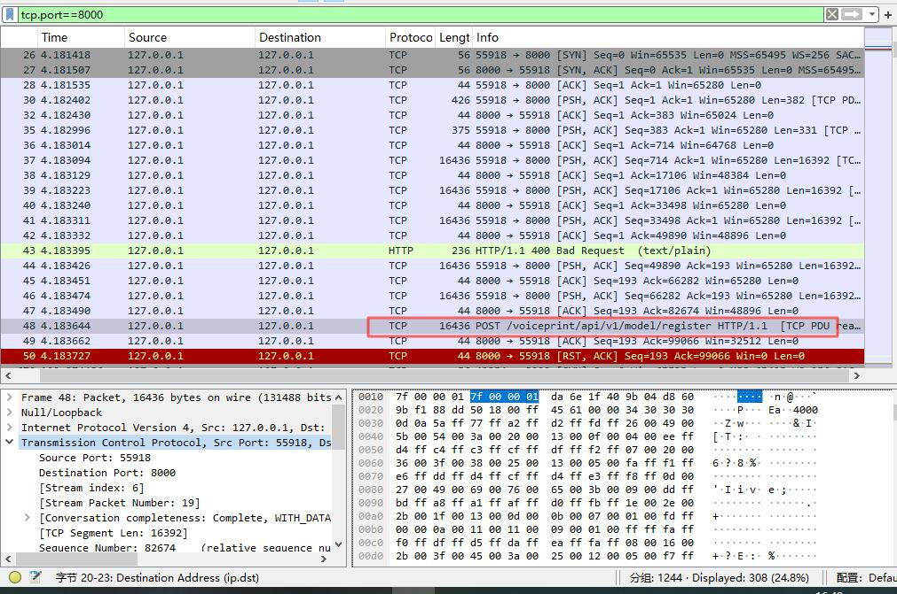

# 测试RestClient和RestTemplate问题
Testing RestClient and RestTemplate Issues

描述: 在使用RestClient或restTemplate的建造者模式，在带参数上传文件的场景下，无法正常传参。
仅能使用new RestTemplate()构建出来的客户端

Description: When using the builder pattern with RestClient or RestTemplate to upload files with parameters, parameter passing fails.
Only clients constructed using `new RestTemplate()` function properly.

参见：https://github.com/spring-projects/spring-boot/issues/48393

# 终结
测试结果：设置客户端请求工程
优先级：HttpComponentsClientHttpRequestFactory > SimpleClientHttpRequestFactory
问题出现在新版JdkClientHttpRequestFactory中对multipart请求处理时，本质原因是其默认http2协议，在三次握手过程中协商失败，回退1.1失败。您可以在配置中设置http1.1。

在 multipart/form-data 上传时，客户端可能已经开始写 body，但 ALPN 协商还没完成
-> 客户端（JDK HttpClient）发出 HTTP/2（或带 h2 ALPN）

-> 服务器（FastAPI/Uvicorn）设置了 HTTP/1.1

-> 发生 ALPN 协商失败 → 协商降级 → body 已经开始发送 → Stream reset

-> 服务端直接 RST（图中红框那段）

-> 然后 Spring 报：
EOF reached while reading
header parser received no bytes
https://docs.springjava.cn/spring-framework/reference/integration/rest-clients.html#rest-request-factories